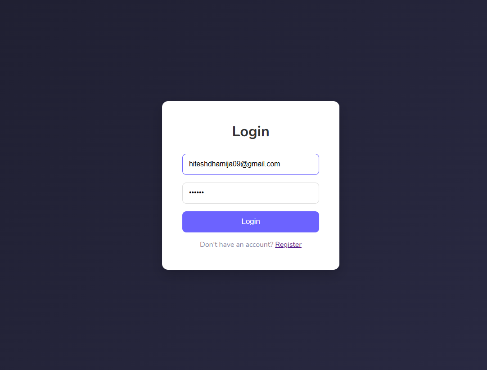
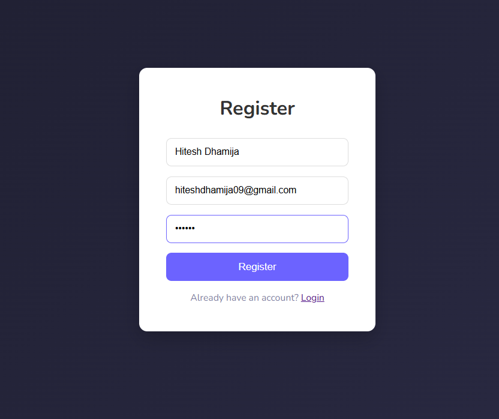
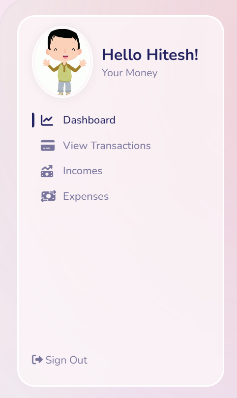
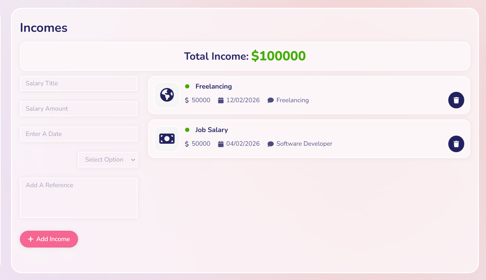
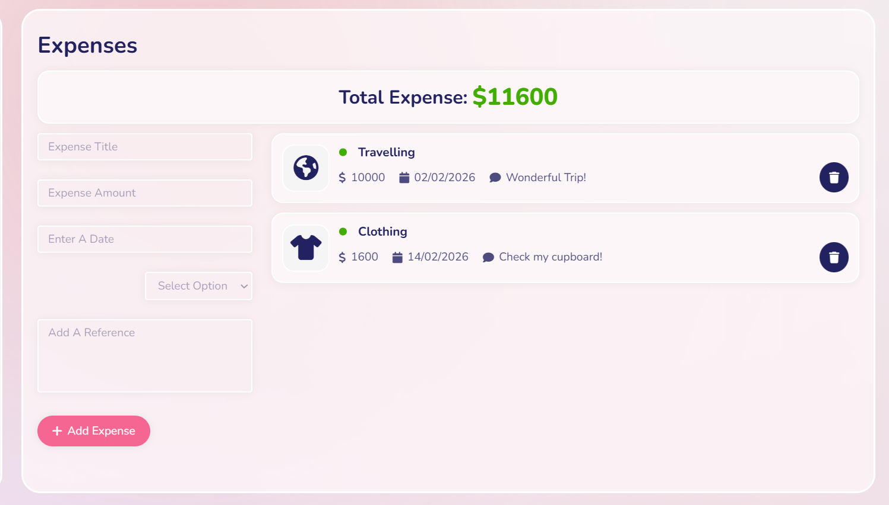

# 💰 SpendGraph - MERN Expense Manager

A full-stack Expense Tracking Application built using the MERN stack (MongoDB, Express, React, Node.js).

## 🚀 Features

- 🔐 JWT Authentication (Login / Register)
- ➕ Add Income & Expenses
- ❌ Delete Transactions
- 📊 Dashboard with financial summary
- 📈 Recent Transaction History
- 🔒 Protected Routes
- 🔄 Axios Interceptor for Token Handling
- 🧾 User-specific data isolation

---

## 🛠 Tech Stack

Frontend:

- React.js
- Styled Components
- Axios
- React Router

Backend:

- Node.js
- Express.js
- MongoDB
- Mongoose
- JWT Authentication

---

## 📸 Screenshots

### 🔐 Login Page



### 🔐 Register Page



### 💸 Navigation Bar



### 📊 Dashboard


### 💸 Income Page



### 💸 Expenses Page



---

## ⚙️ Installation

### 1️⃣ Clone Repository

```bash
git clone https://github.com/your-username/spendgraph.git
```
